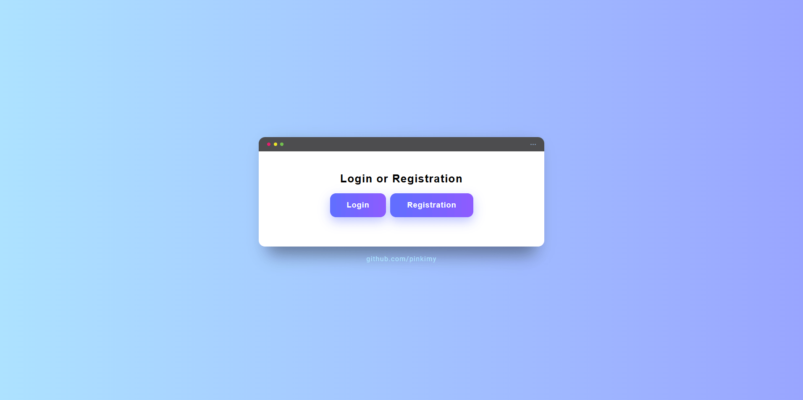

# PHP Authentication Project

Simple PHP authentication system with login and registration functionality.



## Features
- User registration
- User login
- Session handling
- Basic validation
- Clean project structure

## Technologies
- PHP
- HTML / CSS
- MySQL
- Git
- Phpmailer
- Phpdotenv
- Mysqli

## requirements : phpmailer 
```
composer require phpmailer/phpmailer

```
## requirements : vlucas/phpdotenv

```

composer require vlucas/phpdotenv

```

## Usage
- Register new account
- Login with credentials
- Logout via logout button

## Branches
- **main** – stable working version
- **dev** – authentication feature development
- **basic-auth** – old branch development

## Author
github.com/pinkimy

## License
Free for learning and personal use.